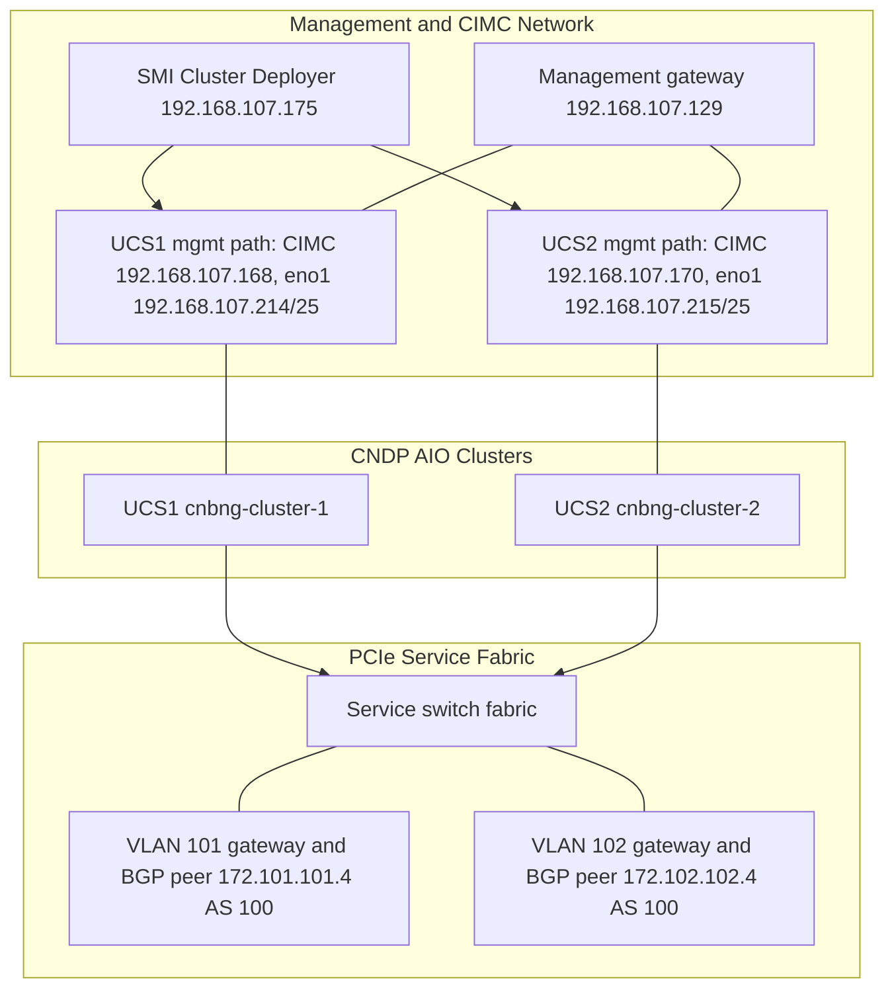
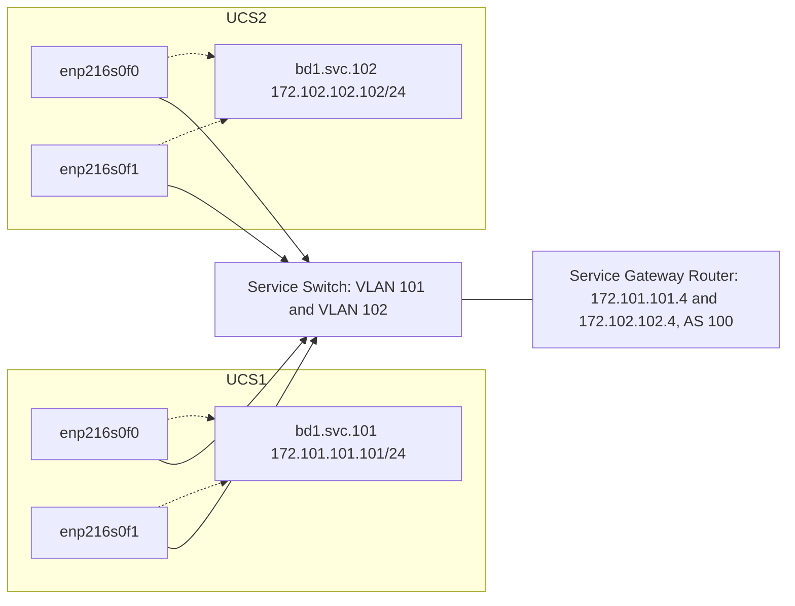
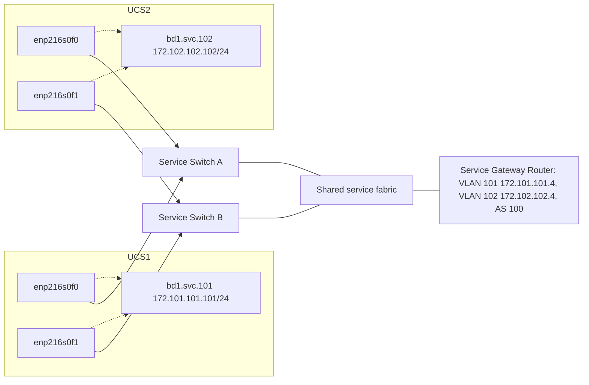

# Manual Deployment: CNDP AIO Geo-Red Cluster Deployer Guide

This guide explains how to manually build the cluster deployment configuration in SMI Cluster Deployer for a two-UCS CNDP AIO geo-redundant cnBNG control-plane deployment.

The goal of this deployment stage is to provision:

- The baremetal CNDP cluster on each UCS server.
- The Kubernetes control-plane node.
- The CEE Ops Center.
- The cnBNG BNG Ops Center.
- Management ingress and the service-side network/VIP plumbing needed before application initialization.

Application initialization, CDL configuration, BGP application configuration, subscriber instances, and geo-replication application settings are outside the scope of this guide. However, the cluster deployment must still establish the management, PCIe service, route, VIP, and switch-port foundation that those later stages depend on.

## Deployment Shape

This deployment uses two independent single-node CNDP clusters:

| Site | Cluster | Cluster ID | Cluster Mgmt IP | CIMC IP | Service VLAN | Service IP |
|---|---|---:|---|---|---:|---|
| UCS1 | `cnbng-cluster-1` | `1` | `192.168.107.214/25` | `192.168.107.168` | `101` | `172.101.101.101/24` |
| UCS2 | `cnbng-cluster-2` | `2` | `192.168.107.215/25` | `192.168.107.170` | `102` | `172.102.102.102/24` |

The cluster management IPs are host-side CNDP management addresses, not CIMC addresses. In this lab design, the cluster management path uses the same physical management port/cabling as CIMC. That means each UCS needs one management-side port path that can reach both the CIMC IP and the host CNDP management IP after installation.

Both clusters are created in the same SMI Cluster Deployer:

| Item | Value |
|---|---|
| Cluster Deployer IP | `192.168.107.175` |
| Cluster Deployer CLI | `ssh admin@192.168.107.175 -p 2022` |
| Cluster Deployer NETCONF | `192.168.107.175:830` |



## Management Port Model

Each UCS has two management addresses in this design:

| Site | CIMC Management IP | Cluster Management IP | Physical Path |
|---|---|---|---|
| UCS1 | `192.168.107.168` | `192.168.107.214/25` | Same UCS management port/cabling path |
| UCS2 | `192.168.107.170` | `192.168.107.215/25` | Same UCS management port/cabling path |

The CIMC IP is used by Cluster Deployer to control the UCS server during baremetal provisioning. The cluster management IP is assigned to the installed CNDP host on `eno1` and is later used for Kubernetes node access, Ops Center SSH, Ops Center NETCONF, ingress, and monitoring.

Because both addresses use the same management-side port path, the management switch/network must allow both the CIMC address and the cluster management address for each UCS. Treat them as two different endpoints on the same management-side cabling path, not as one shared IP. The current configuration assumes the host management network is presented directly to `eno1`; if the site requires VLAN tagging on the management side, confirm the exact Cluster Deployer field model before entering this section.

Do not use the PCIe service interfaces for cluster management. The PCIe service interfaces `enp216s0f0` and `enp216s0f1` are reserved for the `bd1` active-backup service bond and the `bd1.svc.<vlan>` service VLAN subinterfaces.

### UCS Rear-Port Interpretation

The UCS C220 M5/M6 rear-panel documentation shows three relevant network port classes:

| Rear-Port Class | Host / CIMC Use In This Deployment | Notes |
|---|---|---|
| Dual onboard LAN ports, labeled `LAN1` and `LAN2` | Use `LAN1` as the preferred physical path for host `eno1` and CIMC shared access | Cisco documents these as dual 1G/10GBase-T LOM ports. This is the correct class of port when host management and CIMC must share the same physical network path. |
| Dedicated 1G management RJ45 | Do not use as the shared `eno1` path | This port is for Cisco IMC/CIMC dedicated management. A host OS interface such as `eno1` does not use this dedicated management-only port. |
| mLOM / PCIe adapter ports | Use the two service ports that Linux names `enp216s0f0` and `enp216s0f1` | These are the physical members of `bd1`. They should connect to the service switch fabric, not the management network. |

For the management design in this guide, set CIMC to use a shared LOM path, such as Shared LOM or Shared LOM Extended, so the CIMC IP and the host `eno1` IP are reachable through the same management-side port path. If CIMC is configured for Dedicated mode, the CIMC IP uses the dedicated management RJ45 and no longer shares the same physical path as host `eno1`.

For the service design, `enp216s0f0` and `enp216s0f1` are Linux predictable names for two functions/ports on the same PCIe NIC device. In physical cabling terms, cable adapter port 1/function 0 as `enp216s0f0`, and adapter port 2/function 1 as `enp216s0f1`. On a C220 M6 with the two-port 100G mLOM adapter installed, those are expected to be the two rear mLOM ports. If the server instead uses a dual-port PCIe NIC in a riser, the ports are on that riser card. Confirm the exact adapter location from CIMC inventory or the host OS before final cabling labels are printed.

| Plane | UCS / Linux Construct | Carries | Network Expectation |
|---|---|---|---|
| UCS out-of-band management | UCS management-side port path / CIMC | UCS control access: `192.168.107.168`, `192.168.107.170` | Reachable from Cluster Deployer and engineering management hosts |
| CNDP host management | `eno1` | Cluster management IPs: `192.168.107.214/25`, `192.168.107.215/25` | Same physical management path as CIMC; default gateway `192.168.107.129` |
| PCIe service link A | `enp216s0f0` | Bond member only | Connected to service switching fabric, no host IP |
| PCIe service link B | `enp216s0f1` | Bond member only | Connected to service switching fabric, no host IP |
| Service bond | `bd1` | Active-backup parent link | No IP address on the bond itself |
| Service VLANs | `bd1.svc.101`, `bd1.svc.102` | Service IPs, VIPs, service routes | VLAN `101` for UCS1, VLAN `102` for UCS2 |
| Routing handoff | Service gateway / router | Cluster deployment routes and later BGP peering | `172.101.101.4` and `172.102.102.4`, remote AS `100` |

## Physical And Network Prerequisites

Before creating the cluster configuration, verify the following.

| Area | Requirement |
|---|---|
| CIMC reachability | Cluster Deployer can reach `192.168.107.168` and `192.168.107.170` |
| Cluster management IPs | `192.168.107.214/25` and `192.168.107.215/25` are free and reachable through gateway `192.168.107.129` |
| Shared management port logic | CIMC and cluster management use the same physical management port/cabling on each UCS |
| DNS | `72.163.128.140` is reachable from the management network |
| NTP | `72.163.32.44` is reachable |
| Image web server | Cluster Deployer can download BNG, CEE, and host profile images |
| UCS port map | The physical UCS management port, PCIe `enp216s0f0`, and PCIe `enp216s0f1` are mapped to named switch ports before deployment |
| Service switch design | Select either the one-switch or two-switch PCIe service option before cabling |
| PCIe service links | `enp216s0f0` and `enp216s0f1` on each UCS are connected to the service switching fabric |
| Service VLANs | VLAN `101` is available for UCS1, VLAN `102` is available for UCS2 |
| Service routing | UCS1 can route to `172.102.102.0/24` through `172.101.101.4`; UCS2 can route to `172.101.101.0/24` through `172.102.102.4` |
| BGP readiness | Service gateways `172.101.101.4` and `172.102.102.4` are reserved as later BGP neighbors in remote AS `100` |
| Geo service readiness | Service network policy allows the planned inter-cluster service and geo ports: `8882`, `10001`, `7001`-`7004` |

The service bond is active-backup:

| Bond | Member Interfaces | Mode | UCS1 VLAN Interface | UCS2 VLAN Interface |
|---|---|---|---|---|
| `bd1` | `enp216s0f0`, `enp216s0f1` | `active-backup` | `bd1.svc.101` | `bd1.svc.102` |

`bd1` is a logical Linux bond, not a separate physical connection to the service switch. The only physical service-side connections are the two PCIe member links: `enp216s0f0` and `enp216s0f1`. The service VLAN interface is then created on top of the bond as `bd1.svc.101` for UCS1 and `bd1.svc.102` for UCS2.

Do not place the cluster management IPs on the PCIe service bond. The PCIe ports carry only the service-side bond and service VLANs. The cluster management IPs are configured on the management interface path that shares the same physical port/cabling as CIMC.

## AIO Alignment With Three-Server Geo-Red Design

The three-server geo-red control-plane design separates Kubernetes, management, service, geo-sync, CDL, and eBGP traffic across multiple logical networks and bonds. In this AIO deployment, those same responsibilities still exist, but the physical and logical layout is intentionally collapsed because each site has only one CNDP node.

| Three-Server Design Concept | Typical Three-Server Placement | AIO Alignment In This Guide |
|---|---|---|
| Kubernetes control and cluster access | `k8s` VLAN on `bd0` with a Kubernetes master VIP | Single-node cluster management on `eno1` using `192.168.107.214/25` or `192.168.107.215/25` |
| Management and Ops access | `mgmt` VLAN on `bd0` with an additional management VIP | Same `eno1` management path; Ops Center SSH, NETCONF, ingress, and monitoring bind to the cluster management IP |
| Service / N4 / User Plane reachability | `n4` VLAN on `bd2` with service VIPs advertised through BGP | `bd1.svc.101` on UCS1 and `bd1.svc.102` on UCS2 carry service IPs, service VIPs, User Plane Loopback0 route, and later BGP reachability |
| Geo TCP synchronization | `inttcp` VLAN on `bd1` | Collapsed onto the AIO service VLAN and routed between the two AIO clusters |
| Geo UDP traffic | `intudp` VLAN on `bd2` | Collapsed onto the AIO service VLAN and allowed through the service fabric |
| CDL / geo-replication network | `cdl` VLAN on `bd1` | Collapsed onto the AIO service VLAN; required CDL and geo ports must be permitted between service IPs |
| eBGP handoff | Two eBGP interfaces from protocol nodes, normally for redundancy | One BGP readiness path per AIO cluster through the service gateway: UCS1 to `172.101.101.4`, UCS2 to `172.102.102.4` |
| Node role placement | OAM, protocol, service, and session/CDL labels spread across three UCS nodes | Single AIO node carries the required local control-plane functions for that cluster |

The operational simplification is: keep the three-server intent, but reduce the network contract to two planes per AIO site:

- Management plane: `eno1`, shared management-side path with CIMC, used for Kubernetes node access and Ops Center access.
- Service plane: `bd1` active-backup bond over `enp216s0f0` and `enp216s0f1`, with one service VLAN subinterface per site.

Do not try to reproduce the full three-server `bd0` / `bd1` / `bd2` interface split in the AIO deployment. The AIO model is valid because service, geo, CDL, BGP readiness, and User Plane reachability are all carried through the service VLAN and its service gateway.

## Service Switch Design Options

Both options below can support this deployment. Choose the option with the network engineering team before entering the cluster configuration, because the switch-port mode, VLAN placement, and failure behavior must match the `bd1` active-backup bond model.

| Option | PCIe Cabling Model | When To Use | Important Constraint |
|---|---|---|---|
| One service switch | Both PCIe service links from both UCS servers land on one service switch | Fastest lab bring-up and simplest troubleshooting | The service switch is the service-side failure domain |
| Two service switches | `enp216s0f0` lands on service switch A and `enp216s0f1` lands on service switch B for each UCS | Use when PCIe switch redundancy is required | The two switches must present a shared service fabric or equivalent gateway reachability for VLANs `101` and `102` |

The bond mode is active-backup, not LACP. Only one PCIe member forwards traffic at a time. Do not split the two bond members across isolated switches unless the routed design has been explicitly validated for failover, gateway reachability, and the required service VLANs.

### One-Switch PCIe Service Option



Use this option when the goal is a controlled lab deployment or early integration. It minimizes variables: all service VLANs, service gateways, and BGP peer reachability are on one service switching point.

### Two-Switch PCIe Service Option



Use this option only when both service switches behave as one validated service fabric for the required VLANs and gateways, or when an explicitly designed routed equivalent exists. A two-switch physical layout without shared service reachability can look redundant in the cabling diagram while still breaking service traffic during bond failover.

## Service Routing And BGP Readiness

This deployment creates the service VLAN interfaces, service routes, and service VIP group. It does not configure the cnBNG application BGP session. Still, the network handoff must be agreed now because later BGP sessions use the same service gateway addresses as the deployment route next-hops.

The service route to `172.0.0.0/8` is required to reach User Plane Loopback0 addresses. In this deployment guide, all User Plane Loopback0 addresses are assumed to live inside the `172.0.0.0/8` network, so each CNDP AIO cluster needs a route for that summary through its local service gateway.

| Site | Service Interface | Host Routes | Later BGP Readiness |
|---|---|---|---|
| UCS1 | `bd1.svc.101`, `172.101.101.101/24` | `172.102.102.0/24 via 172.101.101.4`; `172.0.0.0/8 via 172.101.101.4` | Local AS `65151`, neighbor `172.101.101.4`, remote AS `100` |
| UCS2 | `bd1.svc.102`, `172.102.102.102/24` | `172.101.101.0/24 via 172.102.102.4`; `172.0.0.0/8 via 172.102.102.4` | Local AS `65152`, neighbor `172.102.102.4`, remote AS `100` |

The BGP neighbor is the service gateway/router in AS `100`, not the other UCS server. UCS-to-UCS service reachability is provided through the service routing fabric and the host routes above. Later cnBNG VIP advertisement policy for `1.1.100.1/32` and `2.2.100.2/32` must be aligned with the network team before application initialization.

## Port-Map Worksheet

Complete this worksheet with the data center cabling and switching team before deploying either cluster.

| Site | Interface / Role | Expected Logical Name | Physical UCS Port | Switch | Switch Port | VLAN / Mode | Owner Notes |
|---|---|---|---|---|---|---|---|
| UCS1 | CIMC and host management path | CIMC plus `eno1` | Rear onboard `LAN1` / LOM1, using CIMC Shared LOM or Shared LOM Extended mode | Management switch | TBD | Management network, gateway `192.168.107.129` | Carries CIMC `192.168.107.168` and host `192.168.107.214/25`; do not use dedicated CIMC-only RJ45 if same-path host management is required |
| UCS1 | PCIe service link A | `enp216s0f0` | Service adapter port 1 / function 0, expected mLOM port 1 when the two-port mLOM adapter is installed | Service switch A or one-switch fabric | TBD | Bond member, VLAN `101` reachable through `bd1.svc.101` | No IP on physical interface |
| UCS1 | PCIe service link B | `enp216s0f1` | Service adapter port 2 / function 1, expected mLOM port 2 when the two-port mLOM adapter is installed | Service switch B or one-switch fabric | TBD | Bond member, VLAN `101` reachable through `bd1.svc.101` | No IP on physical interface |
| UCS2 | CIMC and host management path | CIMC plus `eno1` | Rear onboard `LAN1` / LOM1, using CIMC Shared LOM or Shared LOM Extended mode | Management switch | TBD | Management network, gateway `192.168.107.129` | Carries CIMC `192.168.107.170` and host `192.168.107.215/25`; do not use dedicated CIMC-only RJ45 if same-path host management is required |
| UCS2 | PCIe service link A | `enp216s0f0` | Service adapter port 1 / function 0, expected mLOM port 1 when the two-port mLOM adapter is installed | Service switch A or one-switch fabric | TBD | Bond member, VLAN `102` reachable through `bd1.svc.102` | No IP on physical interface |
| UCS2 | PCIe service link B | `enp216s0f1` | Service adapter port 2 / function 1, expected mLOM port 2 when the two-port mLOM adapter is installed | Service switch B or one-switch fabric | TBD | Bond member, VLAN `102` reachable through `bd1.svc.102` | No IP on physical interface |

Use the following commands or inventory views to confirm the service adapter before cabling labels are finalized:

```text
ip -br link
ethtool -i enp216s0f0
ethtool -i enp216s0f1
lspci -D | grep -i -E 'ethernet|network|mellanox|broadcom|intel|cisco'
```

CIMC inventory can also be used to confirm whether the two service ports are on the mLOM bay or on a PCIe riser card.

## Failure Behavior To Confirm

| Failure / Test | Expected Deployment Behavior | Engineering Check |
|---|---|---|
| One PCIe member link fails | `bd1` remains up through the standby member | Active-backup failover works and the service VLAN remains reachable |
| One service switch fails in one-switch option | Service plane is unavailable | This is accepted only for lab/simple integration use |
| One service switch fails in two-switch option | Service plane remains reachable if the shared fabric/gateway design is correct | Confirm VLAN, gateway, and route reachability through the surviving path |
| Management path fails | CIMC, Cluster Deployer access, Ops Center access, and Kubernetes management access are impacted | Confirm management cabling, switchport, and gateway redundancy expectations |
| Service gateway/BGP peer path fails | Service routes fail; later BGP peering and VIP advertisement fail | Confirm gateway ownership and route policy before application initialization |

## Cluster Deployer Configuration Order

Build the configuration in this order for each UCS cluster:

1. Software catalog.
2. Baremetal environment.
3. Cluster identity and cluster-level settings.
4. Node defaults.
5. Node type defaults.
6. UCS node definition.
7. Service VIP group.
8. Ops Center definitions.
9. Addons.
10. Commit and monitor sync.

Complete UCS1 first, then repeat the same structure for UCS2 with the UCS2 values.

The examples below use Cluster Deployer XML/YANG field names as precise configuration references. They are configuration fragments, not complete standalone payloads. If you are entering the configuration through the Cluster Deployer CLI or UI, enter the equivalent fields in the same order. Replace password and SSH key placeholders with site-approved values.

## 1. Add Software Catalog Entries

Create or confirm these software entries in the Cluster Deployer software catalog.

### BNG CNF Image

| Field | Value |
|---|---|
| Name | `bng.ntt.dev` |
| URL | `http://192.168.107.152/images/CP/2026.02.1.i07/bng-dev-ntt-demo-private.SSA.tgz` |
| SHA256 | `c94df243a3904a25b453580a4b74b0171e267af3dd3d2f7087105abcf3bb2b8a` |
| Catalog label | `bng-products` |

### CEE CNF Image

| Field | Value |
|---|---|
| Name | `cee-2026.02.1.i07` |
| URL | `http://192.168.107.152/images/CP/2026.02.1.i07/cee-2026.02.1.i07.tar` |
| SHA256 | `469ccbf808d0aa32e40d50aa97f88d74129cc346d0b0ac82cc8087f9e65fbe69` |
| Catalog label | `cee-products` |

### Host Profile

| Field | Value |
|---|---|
| Name | `bios-ht-25` |
| URL | `http://192.168.107.152/images/CP/ht.tgz` |
| SHA256 | `aa7e240f2b785a8c8d6b7cd6f79fe162584dc01b7e9d32a068be7f6e5055f664` |

Relevant config:

```xml
<software xmlns="http://cisco.com/sp/cloud/infra">
  <cnf>
    <name>bng.ntt.dev</name>
    <url>http://192.168.107.152/images/CP/2026.02.1.i07/bng-dev-ntt-demo-private.SSA.tgz</url>
    <sha256>c94df243a3904a25b453580a4b74b0171e267af3dd3d2f7087105abcf3bb2b8a</sha256>
    <description>bng-products</description>
  </cnf>
  <cnf>
    <name>cee-2026.02.1.i07</name>
    <url>http://192.168.107.152/images/CP/2026.02.1.i07/cee-2026.02.1.i07.tar</url>
    <sha256>469ccbf808d0aa32e40d50aa97f88d74129cc346d0b0ac82cc8087f9e65fbe69</sha256>
    <description>cee-products</description>
  </cnf>
  <host-profile>
    <name>bios-ht-25</name>
    <url>http://192.168.107.152/images/CP/ht.tgz</url>
    <sha256>aa7e240f2b785a8c8d6b7cd6f79fe162584dc01b7e9d32a068be7f6e5055f664</sha256>
  </host-profile>
</software>
```

## 2. Add Baremetal Environment

Create one baremetal environment entry:

| Field | Value |
|---|---|
| Environment name | `bare-metal` |
| Server type | `ucs-server` |

Both UCS1 and UCS2 clusters use this same environment.

Relevant config:

```xml
<environments xmlns="http://cisco.com/sp/cloud/infra">
  <name>bare-metal</name>
  <ucs-server/>
</environments>
```

## 3. Build UCS1 Cluster

### 1. Cluster Identity

Create cluster `cnbng-cluster-1`.

| Field | Value |
|---|---|
| Cluster name | `cnbng-cluster-1` |
| Environment | `bare-metal` |
| Auto sync | enabled |
| Master virtual IP / cluster management IP | `192.168.107.214` |
| Master virtual IP interface | `eno1` |
| Pod subnet | `192.204.0.0/16` |
| Allow insecure registry | `true` |
| Restrict logging | `false` |
| Enable network policy | `false` |
| Enable SSH firewall rules | `false` |

Relevant config:

```xml
<clusters xmlns="http://cisco.com/sp/cloud/infra">
  <name>cnbng-cluster-1</name>
  <environment>bare-metal</environment>
  <auto-sync></auto-sync>
  <configuration>
    <master-virtual-ip>192.168.107.214</master-virtual-ip>
    <master-virtual-ip-interface>eno1</master-virtual-ip-interface>
    <enable-pod-security-policy>false</enable-pod-security-policy>
    <pod-subnet>192.204.0.0/16</pod-subnet>
    <allow-insecure-registry>true</allow-insecure-registry>
    <restrict-logging>false</restrict-logging>
    <enable-network-policy>false</enable-network-policy>
    <enable-ssh-firewall-rules>false</enable-ssh-firewall-rules>
  </configuration>
  ...
</clusters>
```

### 2. Node Defaults

Configure the default node access and boot settings.

| Field | Value |
|---|---|
| SSH username | `cloud-user` |
| Default user | `cloud-user` |
| Default user password | site-specific first boot password |
| Password expiration days | `0` |
| NTP server | `72.163.32.44` |
| NTP enabled | `true` |
| Tuned enabled | `true` |

Add the service bond:

| Bond Field | Value |
|---|---|
| Device ID | `bd1` |
| Interfaces | `enp216s0f0`, `enp216s0f1` |
| DHCPv4 | `false` |
| DHCPv6 | `false` |
| Optional | `true` |
| Mode | `active-backup` |
| MII monitor interval | `100` |
| Failover MAC policy | `active` |

Disable DHCP on the physical service interfaces:

| Interface | DHCPv4 | DHCPv6 |
|---|---|---|
| `enp216s0f0` | `false` | `false` |
| `enp216s0f1` | `false` | `false` |

Add CIMC defaults:

| Field | Value |
|---|---|
| CIMC user | `admin` |
| Create virtual drive | `true` |
| SOL enabled | `true` |
| SOL baud rate | `115200` |
| SOL comport | `com0` |
| SOL SSH port | `2400` |
| CIMC NTP server | `72.163.32.44` |

Relevant config:

```xml
<node-defaults>
  <ssh-username>cloud-user</ssh-username>
  <ssh-connection-private-key>REPLACE_WITH_SITE_APPROVED_PRIVATE_KEY</ssh-connection-private-key>
  <initial-boot>
    <default-user>cloud-user</default-user>
    <default-user-ssh-public-key>REPLACE_WITH_SITE_APPROVED_PUBLIC_KEY</default-user-ssh-public-key>
    <default-user-password>REPLACE_WITH_FIRST_BOOT_PASSWORD</default-user-password>
    <default-user-password-expiration-days>0</default-user-password-expiration-days>
    <netplan>
      <ethernets>
        <device-id>eno1</device-id>
        <dhcp4>false</dhcp4>
        <dhcp6>false</dhcp6>
      </ethernets>
      <ethernets>
        <device-id>enp216s0f0</device-id>
        <dhcp4>false</dhcp4>
        <dhcp6>false</dhcp6>
      </ethernets>
      <ethernets>
        <device-id>enp216s0f1</device-id>
        <dhcp4>false</dhcp4>
        <dhcp6>false</dhcp6>
      </ethernets>
      <bonds>
        <device-id>bd1</device-id>
        <dhcp4>false</dhcp4>
        <dhcp6>false</dhcp6>
        <optional>true</optional>
        <interfaces>enp216s0f0</interfaces>
        <interfaces>enp216s0f1</interfaces>
        <parameters>
          <mode>active-backup</mode>
          <mii-monitor-interval>100</mii-monitor-interval>
          <fail-over-mac-policy>active</fail-over-mac-policy>
        </parameters>
      </bonds>
    </netplan>
  </initial-boot>
  <ucs-server>
    <cimc>
      <user>admin</user>
      <storage-adaptor>
        <create-virtual-drive>true</create-virtual-drive>
      </storage-adaptor>
      <remote-management>
        <sol>
          <enabled>true</enabled>
          <baud-rate>115200</baud-rate>
          <comport>com0</comport>
          <ssh-port>2400</ssh-port>
        </sol>
      </remote-management>
      <networking>
        <ntp>
          <enabled>true</enabled>
          <servers>
            <url>72.163.32.44</url>
          </servers>
        </ntp>
      </networking>
    </cimc>
  </ucs-server>
  <os>
    <ntp>
      <servers>
        <url>72.163.32.44</url>
      </servers>
      <enabled>true</enabled>
    </ntp>
    <tuned>
      <enabled>true</enabled>
    </tuned>
  </os>
</node-defaults>
```

### 3. Node Type Defaults

Create node type defaults for `control-plane`.

| Field | Value |
|---|---|
| Node type | `control-plane` |
| Management device ID | `eno1` |
| DNS search domain | `cisco.com` |
| DNS server | `72.163.128.140` |
| Default route | `0.0.0.0/0` |
| Default gateway | `192.168.107.129` |

Relevant config:

```xml
<node-type-defaults>
  <type>control-plane</type>
  <initial-boot>
    <netplan>
      <ethernets>
        <device-id>eno1</device-id>
        <nameservers>
          <search>cisco.com</search>
          <addresses>72.163.128.140</addresses>
        </nameservers>
        <routes>
          <to>0.0.0.0/0</to>
          <via>192.168.107.129</via>
        </routes>
      </ethernets>
    </netplan>
  </initial-boot>
</node-type-defaults>
```

### 4. UCS Node

Create the UCS node.

| Field | Value |
|---|---|
| Node name | `aio` |
| Host profile | `bios-ht-25` |
| K8s node type | `control-plane` |
| SSH IP | `192.168.107.214` |
| Node IP | `192.168.107.214` |
| Node label | `disktype=ssd` |
| Node label | `smi.cisco.com/node-type=oam` |

Configure the UCS CIMC connection:

| Field | Value |
|---|---|
| CIMC IP | `192.168.107.168` |
| CIMC user | `admin` |
| CIMC password | site-specific CIMC password |

Configure the node management interface:

| Field | Value |
|---|---|
| Device ID | `eno1` |
| Address | `192.168.107.214/25` |

This `eno1` address is the UCS1 cluster management IP. It must be reachable through the same management port/path used for UCS1 CIMC access.

Configure the node service VLAN:

| Field | Value |
|---|---|
| Device ID | `bd1.svc.101` |
| VLAN ID | `101` |
| Parent link | `bd1` |
| DHCPv4 | `false` |
| DHCPv6 | `false` |
| Address | `172.101.101.101/24` |
| Route | `172.102.102.0/24 via 172.101.101.4` |
| User Plane Loopback0 summary route | `172.0.0.0/8 via 172.101.101.4` |

The `172.0.0.0/8` route is needed so UCS1 can reach User Plane Loopback0 addresses through the service network. Keep this route aligned with the User Plane loopback addressing plan.

Relevant config:

```xml
<nodes>
  <name>aio</name>
  <host-profile>bios-ht-25</host-profile>
  <k8s>
    <node-type>control-plane</node-type>
    <ssh-ip>192.168.107.214</ssh-ip>
    <node-ip>192.168.107.214</node-ip>
    <node-labels>
      <key>disktype</key>
      <value>ssd</value>
    </node-labels>
    <node-labels>
      <key>smi.cisco.com/node-type</key>
      <value>oam</value>
    </node-labels>
  </k8s>
  <ucs-server>
    <cimc>
      <user>admin</user>
      <password>REPLACE_WITH_UCS1_CIMC_PASSWORD</password>
      <ip-address>192.168.107.168</ip-address>
    </cimc>
  </ucs-server>
  <initial-boot>
    <netplan>
      <ethernets>
        <device-id>eno1</device-id>
        <addresses>192.168.107.214/25</addresses>
      </ethernets>
      <vlans>
        <device-id>bd1.svc.101</device-id>
        <id>101</id>
        <link>bd1</link>
        <dhcp4>false</dhcp4>
        <dhcp6>false</dhcp6>
        <addresses>172.101.101.101/24</addresses>
        <routes>
          <to>172.102.102.0/24</to>
          <via>172.101.101.4</via>
        </routes>
        <routes>
          <to>172.0.0.0/8</to>
          <via>172.101.101.4</via>
        </routes>
      </vlans>
    </netplan>
  </initial-boot>
</nodes>
```

### 5. Service VIP Group

Create service VIP group `svcvip`.

| Field | Value |
|---|---|
| Group | `svcvip` |
| Check port | `20004` |
| Check port | `28000` |
| Check interface | `bd1.svc.101` |
| VRRP interface | `bd1.svc.101` |
| VRRP router ID | `112` |
| Host | `aio` |

Add the service VIP addresses:

| VIP | Mask | Broadcast | Device |
|---|---:|---|---|
| `1.1.100.1` | `32` | `1.1.100.1` | `bd1.svc.101` |
| `2.2.100.2` | `32` | `2.2.100.2` | `bd1.svc.101` |

Relevant config:

```xml
<virtual-ips>
  <group>svcvip</group>
  <check-ports>20004</check-ports>
  <check-ports>28000</check-ports>
  <check-interface>
    <name>bd1.svc.101</name>
  </check-interface>
  <vrrp-interface>bd1.svc.101</vrrp-interface>
  <vrrp-router-id>112</vrrp-router-id>
  <ipv4-addresses>
    <addr>1.1.100.1</addr>
    <mask>32</mask>
    <broadcast>1.1.100.1</broadcast>
    <device>bd1.svc.101</device>
  </ipv4-addresses>
  <ipv4-addresses>
    <addr>2.2.100.2</addr>
    <mask>32</mask>
    <broadcast>2.2.100.2</broadcast>
    <device>bd1.svc.101</device>
  </ipv4-addresses>
  <hosts>
    <name>aio</name>
  </hosts>
</virtual-ips>
```

### 6. Ops Centers

Create the BNG Ops Center entry:

| Field | Value |
|---|---|
| App name | `bng` |
| Instance | `bng` |
| Repository local | `bng.ntt.dev` |
| Sync default repository | `true` |
| NETCONF IP | `192.168.107.214` |
| NETCONF port | `3024` |
| SSH IP | `192.168.107.214` |
| SSH port | `2024` |
| Ingress hostname | `192.168.107.214.nip.io` |
| Use volume claims | `true` |
| First boot password | site-specific BNG Ops Center password |
| Auto deploy | `false` |
| Single node | `true` |

Create the CEE Ops Center entry:

| Field | Value |
|---|---|
| App name | `cee` |
| Instance | `global` |
| Repository local | `cee-2026.02.1.i07` |
| Sync default repository | `true` |
| NETCONF IP | `192.168.107.214` |
| NETCONF port | `3023` |
| SSH IP | `192.168.107.214` |
| SSH port | `2023` |
| Ingress hostname | `192.168.107.214.nip.io` |
| Use volume claims | `true` |
| First boot password | site-specific CEE Ops Center password |
| Auto deploy | `true` |
| Single node | `true` |

Relevant config:

```xml
<ops-centers>
  <app-name>bng</app-name>
  <instance>bng</instance>
  <repository-local>bng.ntt.dev</repository-local>
  <sync-default-repository>true</sync-default-repository>
  <netconf-ip>192.168.107.214</netconf-ip>
  <netconf-port>3024</netconf-port>
  <ssh-ip>192.168.107.214</ssh-ip>
  <ssh-port>2024</ssh-port>
  <ingress-hostname>192.168.107.214.nip.io</ingress-hostname>
  <initial-boot-parameters>
    <use-volume-claims>true</use-volume-claims>
    <first-boot-password>REPLACE_WITH_BNG_OPS_CENTER_PASSWORD</first-boot-password>
    <auto-deploy>false</auto-deploy>
    <single-node>true</single-node>
  </initial-boot-parameters>
</ops-centers>
<ops-centers>
  <app-name>cee</app-name>
  <instance>global</instance>
  <repository-local>cee-2026.02.1.i07</repository-local>
  <sync-default-repository>true</sync-default-repository>
  <netconf-ip>192.168.107.214</netconf-ip>
  <netconf-port>3023</netconf-port>
  <ssh-ip>192.168.107.214</ssh-ip>
  <ssh-port>2023</ssh-port>
  <ingress-hostname>192.168.107.214.nip.io</ingress-hostname>
  <initial-boot-parameters>
    <use-volume-claims>true</use-volume-claims>
    <first-boot-password>REPLACE_WITH_CEE_OPS_CENTER_PASSWORD</first-boot-password>
    <auto-deploy>true</auto-deploy>
    <single-node>true</single-node>
  </initial-boot-parameters>
</ops-centers>
```

### 7. Addons

Configure addons:

| Addon | Field | Value |
|---|---|---|
| Ingress | Bind IP address | `192.168.107.214` |
| Ingress | Enabled | `true` |
| Istio | Enabled | `false` |

Relevant config:

```xml
<addons>
  <ingress>
    <bind-ip-address>192.168.107.214</bind-ip-address>
    <enabled>true</enabled>
  </ingress>
  <istio>
    <enabled>false</enabled>
  </istio>
</addons>
```

## 4. Build UCS2 Cluster

Create a second cluster using the same section order. Values not listed here are the same as UCS1.

### 1. Cluster Identity

| Field | Value |
|---|---|
| Cluster name | `cnbng-cluster-2` |
| Environment | `bare-metal` |
| Auto sync | enabled |
| Master virtual IP / cluster management IP | `192.168.107.215` |
| Master virtual IP interface | `eno1` |
| Pod subnet | `192.204.0.0/16` |
| Allow insecure registry | `true` |
| Restrict logging | `false` |
| Enable network policy | `false` |
| Enable SSH firewall rules | `false` |

Relevant config:

```xml
<clusters xmlns="http://cisco.com/sp/cloud/infra">
  <name>cnbng-cluster-2</name>
  <environment>bare-metal</environment>
  <auto-sync></auto-sync>
  <configuration>
    <master-virtual-ip>192.168.107.215</master-virtual-ip>
    <master-virtual-ip-interface>eno1</master-virtual-ip-interface>
    <enable-pod-security-policy>false</enable-pod-security-policy>
    <pod-subnet>192.204.0.0/16</pod-subnet>
    <allow-insecure-registry>true</allow-insecure-registry>
    <restrict-logging>false</restrict-logging>
    <enable-network-policy>false</enable-network-policy>
    <enable-ssh-firewall-rules>false</enable-ssh-firewall-rules>
  </configuration>
  ...
</clusters>
```

### 2. Node Type Defaults

| Field | Value |
|---|---|
| Node type | `control-plane` |
| Management device ID | `eno1` |
| DNS search domain | `cisco.com` |
| DNS server | `72.163.128.140` |
| Default route | `0.0.0.0/0` |
| Default gateway | `192.168.107.129` |

### 3. UCS Node

| Field | Value |
|---|---|
| Node name | `aio` |
| Host profile | `bios-ht-25` |
| K8s node type | `control-plane` |
| SSH IP | `192.168.107.215` |
| Node IP | `192.168.107.215` |
| Node label | `disktype=ssd` |
| Node label | `smi.cisco.com/node-type=oam` |

Configure the UCS CIMC connection:

| Field | Value |
|---|---|
| CIMC IP | `192.168.107.170` |
| CIMC user | `admin` |
| CIMC password | site-specific CIMC password |

Configure the node management interface:

| Field | Value |
|---|---|
| Device ID | `eno1` |
| Address | `192.168.107.215/25` |

This `eno1` address is the UCS2 cluster management IP. It must be reachable through the same management port/path used for UCS2 CIMC access.

Configure the node service VLAN:

| Field | Value |
|---|---|
| Device ID | `bd1.svc.102` |
| VLAN ID | `102` |
| Parent link | `bd1` |
| DHCPv4 | `false` |
| DHCPv6 | `false` |
| Address | `172.102.102.102/24` |
| Route | `172.101.101.0/24 via 172.102.102.4` |
| User Plane Loopback0 summary route | `172.0.0.0/8 via 172.102.102.4` |

The `172.0.0.0/8` route is needed so UCS2 can reach User Plane Loopback0 addresses through the service network. Keep this route aligned with the User Plane loopback addressing plan.

Relevant config:

```xml
<nodes>
  <name>aio</name>
  <host-profile>bios-ht-25</host-profile>
  <k8s>
    <node-type>control-plane</node-type>
    <ssh-ip>192.168.107.215</ssh-ip>
    <node-ip>192.168.107.215</node-ip>
    <node-labels>
      <key>disktype</key>
      <value>ssd</value>
    </node-labels>
    <node-labels>
      <key>smi.cisco.com/node-type</key>
      <value>oam</value>
    </node-labels>
  </k8s>
  <ucs-server>
    <cimc>
      <user>admin</user>
      <password>REPLACE_WITH_UCS2_CIMC_PASSWORD</password>
      <ip-address>192.168.107.170</ip-address>
    </cimc>
  </ucs-server>
  <initial-boot>
    <netplan>
      <ethernets>
        <device-id>eno1</device-id>
        <addresses>192.168.107.215/25</addresses>
      </ethernets>
      <vlans>
        <device-id>bd1.svc.102</device-id>
        <id>102</id>
        <link>bd1</link>
        <dhcp4>false</dhcp4>
        <dhcp6>false</dhcp6>
        <addresses>172.102.102.102/24</addresses>
        <routes>
          <to>172.101.101.0/24</to>
          <via>172.102.102.4</via>
        </routes>
        <routes>
          <to>172.0.0.0/8</to>
          <via>172.102.102.4</via>
        </routes>
      </vlans>
    </netplan>
  </initial-boot>
</nodes>
```

### 4. Service VIP Group

| Field | Value |
|---|---|
| Group | `svcvip` |
| Check port | `20004` |
| Check port | `28000` |
| Check interface | `bd1.svc.102` |
| VRRP interface | `bd1.svc.102` |
| VRRP router ID | `112` |
| Host | `aio` |

Add the service VIP addresses:

| VIP | Mask | Broadcast | Device |
|---|---:|---|---|
| `1.1.100.1` | `32` | `1.1.100.1` | `bd1.svc.102` |
| `2.2.100.2` | `32` | `2.2.100.2` | `bd1.svc.102` |

Relevant config:

```xml
<virtual-ips>
  <group>svcvip</group>
  <check-ports>20004</check-ports>
  <check-ports>28000</check-ports>
  <check-interface>
    <name>bd1.svc.102</name>
  </check-interface>
  <vrrp-interface>bd1.svc.102</vrrp-interface>
  <vrrp-router-id>112</vrrp-router-id>
  <ipv4-addresses>
    <addr>1.1.100.1</addr>
    <mask>32</mask>
    <broadcast>1.1.100.1</broadcast>
    <device>bd1.svc.102</device>
  </ipv4-addresses>
  <ipv4-addresses>
    <addr>2.2.100.2</addr>
    <mask>32</mask>
    <broadcast>2.2.100.2</broadcast>
    <device>bd1.svc.102</device>
  </ipv4-addresses>
  <hosts>
    <name>aio</name>
  </hosts>
</virtual-ips>
```

### 5. Ops Centers

Create the BNG Ops Center entry:

| Field | Value |
|---|---|
| App name | `bng` |
| Instance | `bng` |
| Repository local | `bng.ntt.dev` |
| Sync default repository | `true` |
| NETCONF IP | `192.168.107.215` |
| NETCONF port | `3024` |
| SSH IP | `192.168.107.215` |
| SSH port | `2024` |
| Ingress hostname | `192.168.107.215.nip.io` |
| Use volume claims | `true` |
| First boot password | site-specific BNG Ops Center password |
| Auto deploy | `false` |
| Single node | `true` |

Create the CEE Ops Center entry:

| Field | Value |
|---|---|
| App name | `cee` |
| Instance | `global` |
| Repository local | `cee-2026.02.1.i07` |
| Sync default repository | `true` |
| NETCONF IP | `192.168.107.215` |
| NETCONF port | `3023` |
| SSH IP | `192.168.107.215` |
| SSH port | `2023` |
| Ingress hostname | `192.168.107.215.nip.io` |
| Use volume claims | `true` |
| First boot password | site-specific CEE Ops Center password |
| Auto deploy | `true` |
| Single node | `true` |

Relevant config:

```xml
<ops-centers>
  <app-name>bng</app-name>
  <instance>bng</instance>
  <repository-local>bng.ntt.dev</repository-local>
  <sync-default-repository>true</sync-default-repository>
  <netconf-ip>192.168.107.215</netconf-ip>
  <netconf-port>3024</netconf-port>
  <ssh-ip>192.168.107.215</ssh-ip>
  <ssh-port>2024</ssh-port>
  <ingress-hostname>192.168.107.215.nip.io</ingress-hostname>
  <initial-boot-parameters>
    <use-volume-claims>true</use-volume-claims>
    <first-boot-password>REPLACE_WITH_BNG_OPS_CENTER_PASSWORD</first-boot-password>
    <auto-deploy>false</auto-deploy>
    <single-node>true</single-node>
  </initial-boot-parameters>
</ops-centers>
<ops-centers>
  <app-name>cee</app-name>
  <instance>global</instance>
  <repository-local>cee-2026.02.1.i07</repository-local>
  <sync-default-repository>true</sync-default-repository>
  <netconf-ip>192.168.107.215</netconf-ip>
  <netconf-port>3023</netconf-port>
  <ssh-ip>192.168.107.215</ssh-ip>
  <ssh-port>2023</ssh-port>
  <ingress-hostname>192.168.107.215.nip.io</ingress-hostname>
  <initial-boot-parameters>
    <use-volume-claims>true</use-volume-claims>
    <first-boot-password>REPLACE_WITH_CEE_OPS_CENTER_PASSWORD</first-boot-password>
    <auto-deploy>true</auto-deploy>
    <single-node>true</single-node>
  </initial-boot-parameters>
</ops-centers>
```

### 6. Addons

| Addon | Field | Value |
|---|---|---|
| Ingress | Bind IP address | `192.168.107.215` |
| Ingress | Enabled | `true` |
| Istio | Enabled | `false` |

Relevant config:

```xml
<addons>
  <ingress>
    <bind-ip-address>192.168.107.215</bind-ip-address>
    <enabled>true</enabled>
  </ingress>
  <istio>
    <enabled>false</enabled>
  </istio>
</addons>
```

## 5. Commit And Monitor Deployment

After each cluster is fully defined, validate the candidate configuration in Cluster Deployer, then commit it.

Monitor the sync for each cluster:

```text
monitor sync-logs cnbng-cluster-1
monitor sync-logs cnbng-cluster-2
```

Continue only when each cluster reports a successful sync.

Expected result after cluster deployment:

| Result | UCS1 | UCS2 |
|---|---|---|
| CNDP cluster created | `cnbng-cluster-1` | `cnbng-cluster-2` |
| Kubernetes node reachable on cluster management IP | `192.168.107.214` | `192.168.107.215` |
| CEE Ops Center CLI | `ssh admin@192.168.107.214 -p 2023` | `ssh admin@192.168.107.215 -p 2023` |
| CEE Ops Center NETCONF | `192.168.107.214:3023` | `192.168.107.215:3023` |
| BNG Ops Center CLI | `ssh admin@192.168.107.214 -p 2024` | `ssh admin@192.168.107.215 -p 2024` |
| BNG Ops Center NETCONF | `192.168.107.214:3024` | `192.168.107.215:3024` |
| Grafana | `https://grafana.192.168.107.214.nip.io` | `https://grafana.192.168.107.215.nip.io` |
| Service interface | `bd1.svc.101`, `172.101.101.101/24` | `bd1.svc.102`, `172.102.102.102/24` |
| Service route next-hop | `172.101.101.4` | `172.102.102.4` |
| User Plane Loopback0 route | `172.0.0.0/8 via 172.101.101.4` | `172.0.0.0/8 via 172.102.102.4` |

## Deployment Validation Checklist

Use this checklist before moving beyond cluster deployment:

- Both clusters show successful sync in Cluster Deployer.
- The port-map worksheet is complete, including physical UCS ports, switch names, switch ports, VLANs, and ownership notes.
- The selected PCIe service option is documented as either one service switch or two service switches.
- Both Kubernetes nodes are reachable on the management network.
- `eno1` is configured with the expected cluster management address on each UCS.
- Each cluster management IP is reachable over the same management port/path as that UCS server's CIMC IP.
- CIMC remains reachable for UCS1 and UCS2 after host installation.
- `bd1` exists and contains `enp216s0f0` and `enp216s0f1` in active-backup mode.
- Physical PCIe interfaces do not have host IP addresses; service IPs exist only on `bd1.svc.101` and `bd1.svc.102`.
- Service switch ports carry VLAN `101` for UCS1 and VLAN `102` for UCS2 as designed.
- UCS1 has `bd1.svc.101` with `172.101.101.101/24`.
- UCS2 has `bd1.svc.102` with `172.102.102.102/24`.
- UCS1 can reach `172.102.102.0/24` through `172.101.101.4`.
- UCS2 can reach `172.101.101.0/24` through `172.102.102.4`.
- Both clusters have a route to User Plane Loopback0 space `172.0.0.0/8` through their local service gateway.
- User Plane Loopback0 reachability is validated from the service side before application initialization.
- UCS1 can reach its later BGP peer/gateway `172.101.101.4`; UCS2 can reach its later BGP peer/gateway `172.102.102.4`.
- Network engineering confirms later BGP remote AS `100`, UCS1 local AS `65151`, UCS2 local AS `65152`, and VIP advertisement ownership for `1.1.100.1/32` and `2.2.100.2/32`.
- If the two-switch option is used, service reachability is validated after forcing traffic through each PCIe member path.
- Inter-cluster service and geo ports `8882`, `10001`, and `7001`-`7004` are permitted on the service path.
- CEE Ops Center is reachable on SSH and NETCONF ports for both clusters.
- BNG Ops Center is reachable on SSH and NETCONF ports for both clusters.
- Service VIP group `svcvip` is present with VIPs `1.1.100.1` and `2.2.100.2` on each cluster's service VLAN.

## Deployment Troubleshooting

| Symptom | Likely Area | What To Check |
|---|---|---|
| Cluster sync does not start | Candidate config | Cluster name, environment reference, software references |
| Image download fails | Image web server | URL reachability and SHA256 values |
| UCS provisioning fails | CIMC | CIMC IP, credentials, storage adaptor, SOL settings |
| Node cannot be reached after install | Shared management port/network | `eno1`, cluster management IP/mask, default route, DNS, CIMC/shared management port mode, switch port |
| CIMC is reachable but cluster management IP is not | Shared management port/network | Host-side `eno1` configuration, management switchport mode, mask `/25`, gateway `192.168.107.129`, and duplicate IP use |
| Cluster management works but CIMC is lost | Shared management port/network | CIMC VLAN/native network, CIMC IP/gateway, UCS management-port mode, management ACLs |
| Service VLAN is missing | PCIe/bond config | `bd1`, `enp216s0f0`, `enp216s0f1`, service VLAN ID, parent link |
| Bond exists but service VLAN is down | PCIe service links | Physical cabling, switchport admin state, optics/DAC, negotiated speed, and whether both bond members are connected to the intended fabric |
| Peer service subnet unreachable | Service routing | Route next-hop, switch VLAN, gateway interface, ACLs, and whether `172.101.101.4` / `172.102.102.4` are reachable from the correct VLAN |
| Two-switch option fails after moving traffic to standby link | Service fabric design | Whether the switches share the required VLAN/gateway reachability through vPC, MLAG, stack, virtual chassis, or an explicitly validated routed equivalent |
| Later BGP session cannot establish | BGP readiness | Service gateway reachability, remote AS `100`, local AS `65151` or `65152`, ACLs, source interface, and route policy |
| Ops Center not reachable | Ops Center config | NETCONF/SSH IP and port, ingress bind IP, pod health |

## Deployment Boundary

At the end of this guide, the infrastructure and Ops Centers should be deployed and reachable. Service routing and BGP readiness should be validated at the network boundary, but the cnBNG application BGP sessions are not expected to be configured or established yet. Do not expect subscriber-facing cnBNG application behavior, CDL geo-replication, or instance-level service behavior to be complete. Those items belong to the post-cluster initialization stage.
