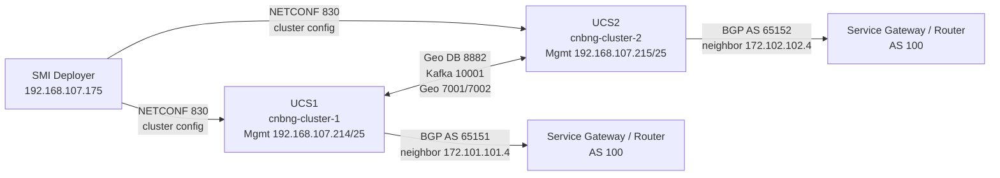
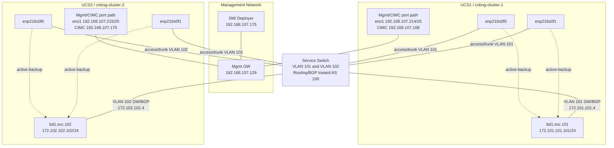
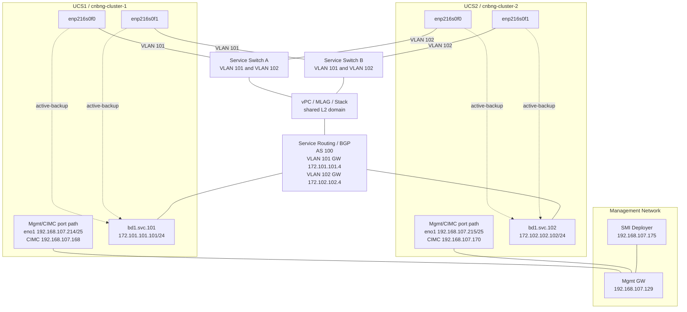

# cnBNG CP CNDP AIO Geo-Red Deployment: Two UCS Topology

This note documents the current all-in-one baremetal CNDP geo-redundant cnBNG control-plane deployment using the two YAML files:

- `yaml/cndp_aio_inputs_ucs1_gr.yaml`
- `yaml/cndp_aio_inputs_ucs2_gr.yaml`

The design is two independent single-node CNDP clusters. Each UCS hosts one AIO cnBNG CP cluster, and the two clusters are paired through geo-replication over the service network.

## Deployment Model

| Site | YAML | Cluster | Cluster ID | Remote ID | Cluster Mgmt IP | CIMC IP |
|---|---|---|---:|---:|---|---|
| UCS1 | `yaml/cndp_aio_inputs_ucs1_gr.yaml` | `cnbng-cluster-1` | `1` | `2` | `192.168.107.214/25` | `192.168.107.168` |
| UCS2 | `yaml/cndp_aio_inputs_ucs2_gr.yaml` | `cnbng-cluster-2` | `2` | `1` | `192.168.107.215/25` | `192.168.107.170` |

The cluster management IPs are the host-side CNDP management addresses. They are separate from the CIMC IPs, but in this topology they use the same physical management port/cabling path as CIMC. The PCIe ports are reserved for the service bond and service VLANs.

Both clusters are deployed by the same SMI deployer:

| Component | Value |
|---|---|
| SMI deployer IP | `192.168.107.175` |
| SMI NETCONF port | `830` |
| SMI CLI port | `2022` |

## Logical Topology



Step 1 deploys the CNDP cluster and Ops Centers. Step 2 initializes the cnBNG CP Ops Center with CDL, geo-replication, instances, service VIPs, and BGP.

```bash
python3 day0-step1.py yaml/cndp_aio_inputs_ucs1_gr.yaml
python3 day0-step1.py yaml/cndp_aio_inputs_ucs2_gr.yaml

# After both clusters and BNG Ops Centers are reachable:
python3 day0-step2.py yaml/cndp_aio_inputs_ucs1_gr.yaml
python3 day0-step2.py yaml/cndp_aio_inputs_ucs2_gr.yaml
```

## Network Summary

| Network | UCS1 | UCS2 | Notes |
|---|---|---|---|
| Management interface | `eno1` | `eno1` | Host-side cluster management interface, using the same management port/path as CIMC |
| Cluster management IP | `192.168.107.214/25` | `192.168.107.215/25` | Gateway `192.168.107.129` |
| CIMC IP | `192.168.107.168` | `192.168.107.170` | Same physical management port/cabling path as cluster management |
| Service bond | `bd1` | `bd1` | Built from PCIe NICs `enp216s0f0` and `enp216s0f1` |
| Service VLAN | `101` | `102` | Rendered as `bd1.svc.101` and `bd1.svc.102` |
| Service IP | `172.101.101.101/24` | `172.102.102.102/24` | Used for CDL and geo traffic |
| Remote service IP | `172.102.102.102` | `172.101.101.101` | Must be reachable through service routing |
| Service route | `172.102.102.0/24 via 172.101.101.4` | `172.101.101.0/24 via 172.102.102.4` | Next-hop also used as BGP neighbor |
| BGP local AS | `65151` | `65152` | Both peer to remote AS `100` |
| Service VIP 1 | `1.1.100.1:3799` | `1.1.100.1:3799` | Advertised/used by cnBNG services |
| Service VIP 2 | `2.2.100.2:3799` | `2.2.100.2:3799` | Advertised/used by cnBNG services |

## PCIe Service Bond

Both YAML files define the service bond in `cnbng_cp.node_defaults.bond_interfaces`:

```yaml
bd1:
  links: [ enp216s0f0, enp216s0f1 ]
```

The cluster template renders this as an active-backup bond:

| Bond | Member PCIe NICs | Mode | VLAN Subinterface |
|---|---|---|---|
| `bd1` | `enp216s0f0`, `enp216s0f1` | `active-backup` | UCS1: `bd1.svc.101`, UCS2: `bd1.svc.102` |

Because the bond is active-backup, only one PCIe member forwards traffic at a time. The second member provides link failure protection.

## Option 1: Single Service Switch

In this option, both PCIe service ports from both UCS servers connect to one service switch. The switch carries VLAN 101 for UCS1 and VLAN 102 for UCS2. The gateway/BGP peer addresses can be SVIs on the same switch or routed interfaces upstream from it.



Single-switch behavior:

- Simplest cabling and switch configuration.
- No service-switch redundancy.
- Both bond members protect only against UCS NIC/cable failure, not switch failure.
- VLAN 101 and VLAN 102 must be routed so UCS1 can reach `172.102.102.102` and UCS2 can reach `172.101.101.101`.
- Cluster management and CIMC traffic stay on the management port/path, separate from PCIe service ports.

## Option 2: Two Service Switches

In this option, each UCS service bond is split across two switches. This is the preferred physical layout when service-switch redundancy is required.

The two switches should act as one logical L2 domain for the server-facing VLANs, for example with vPC, MLAG, stacking, virtual chassis, or an equivalent design. If the two switches are fully independent with no shared L2 domain, do not split one Linux active-backup bond across them unless the routed design has been explicitly validated.



Two-switch behavior:

- Protects against a service switch failure when the switch pair provides a shared L2 service.
- Each UCS keeps one service PCIe link to each switch.
- VLAN 101 must be present on both switch-facing ports connected to UCS1.
- VLAN 102 must be present on both switch-facing ports connected to UCS2.
- Gateways/BGP peers `172.101.101.4` and `172.102.102.4` should remain reachable after either switch fails.
- The management/CIMC port path is unchanged by the one-switch or two-switch PCIe service design.

## Step 1: CNDP Cluster Deployment

For each YAML file, `day0-step1.py` selects the baremetal AIO geo-red deployment path:

```python
elif(data['cnbng_cp']['cluster']['environment']=="baremetal" and data['cnbng_cp']['cluster']['type']=="aio_geo-red"):
    dl.deploy_cndp_aio_gr(data)
```

This renders `template/cluster-config_cndp_aio_gr.j2` and pushes the generated XML to the SMI deployer. The rendered cluster config includes:

- BNG and CEE software image URLs and SHA256 values.
- Host profile image URL and SHA256 value.
- Baremetal UCS server environment.
- Management interface `eno1`.
- Service bond `bd1`.
- Service VLAN subinterface `bd1.svc.<id>`.
- VRRP-style service VIP group `svcvip`.
- BNG Ops Center NETCONF/SSH ports `3024` and `2024`.
- CEE Ops Center NETCONF/SSH ports `3023` and `2023`.

## Step 2: cnBNG Ops Center Initialization

For each YAML file, `day0-step2.py` selects:

```python
elif(data['cnbng_cp']['cluster']['environment']=="baremetal" and data['cnbng_cp']['cluster']['type']=="aio_geo-red"):
    dl.init_cndp_aio_gr(data)
```

This renders `template/bng-ops-center_init-config_cndp_aio_gr.j2` and pushes the generated XML to the BNG Ops Center on the local management IP.

The init config sets:

- CDL `system-id` and `geo-remote-site`.
- Local CDL DB endpoint on port `8882`.
- Local Kafka endpoint on port `10001`.
- Remote DB and Kafka endpoints using the peer service IP.
- Two cnBNG instances, `1` and `2`.
- Local instance based on `cnbng_cp.cluster.id`.
- BNG service VIPs `1.1.100.1` and `2.2.100.2`.
- BGP configuration using the local ASN and service gateway neighbor.

## Addressing Cross-Checks

These are the key pairwise relationships that must remain true:

| Check | Expected |
|---|---|
| UCS1 local service IP equals UCS2 remote service IP | `172.101.101.101` |
| UCS2 local service IP equals UCS1 remote service IP | `172.102.102.102` |
| UCS1 remote route contains UCS2 service IP | `172.102.102.0/24` contains `172.102.102.102` |
| UCS2 remote route contains UCS1 service IP | `172.101.101.0/24` contains `172.101.101.101` |
| UCS1 BGP neighbor equals UCS1 service route next-hop | `172.101.101.4` |
| UCS2 BGP neighbor equals UCS2 service route next-hop | `172.102.102.4` |
| Cluster IDs are crossed | UCS1 `id: 1`, `remote_id: 2`; UCS2 `id: 2`, `remote_id: 1` |

## Operational Checklist

Before running Step 1:

- Confirm `host_profile/ht.tgz` is hosted at the URL in both YAML files.
- Confirm BNG and CEE image URLs are reachable from the SMI deployer.
- Confirm SHA256 values match the hosted files.
- Confirm SMI deployer can reach both CIMC IPs.
- Confirm SMI deployer can reach both cluster management IPs after provisioning.
- Confirm each cluster management IP uses the same management port/path as the corresponding CIMC IP.
- Confirm switch ports for `enp216s0f0` and `enp216s0f1` carry the correct service VLAN.

Before running Step 2:

- Confirm `monitor sync-logs <cluster name>` reports successful sync for both clusters.
- Confirm BNG Ops Center NETCONF is reachable:
  - UCS1: `192.168.107.214:3024`
  - UCS2: `192.168.107.215:3024`
- Confirm service reachability between `172.101.101.101` and `172.102.102.102`.
- Confirm BGP neighbors `172.101.101.4` and `172.102.102.4` are reachable from the local service VLANs.

## Notes And Caveats

- The scripts overwrite the same generated filenames for both clusters:
  - `config/cluster-config_cndp_aio_gr.xml`
  - `config/bng-ops-center_init-config_cndp_aio_gr.xml`
- This is acceptable for immediate push workflows, but save a copy manually if you need to compare the generated XML for UCS1 and UCS2.
- The YAML values `geo_port3` and `geo_port4` exist in both files but are not currently used by `template/bng-ops-center_init-config_cndp_aio_gr.j2`.
- Credentials and private keys are embedded in YAML/templates in the current repo. Treat generated XML as sensitive.
